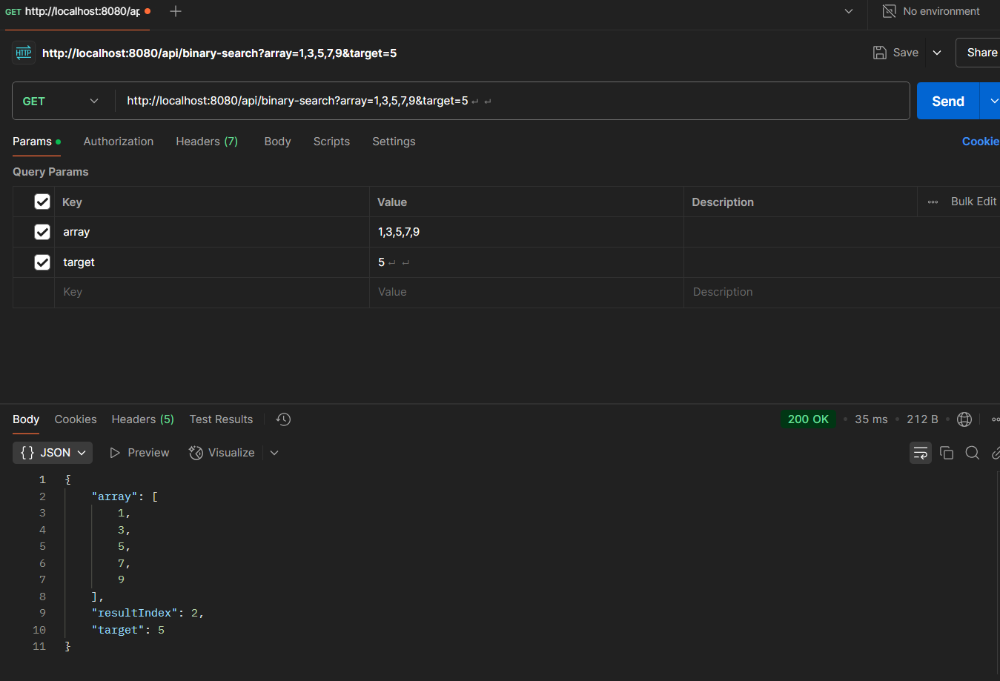
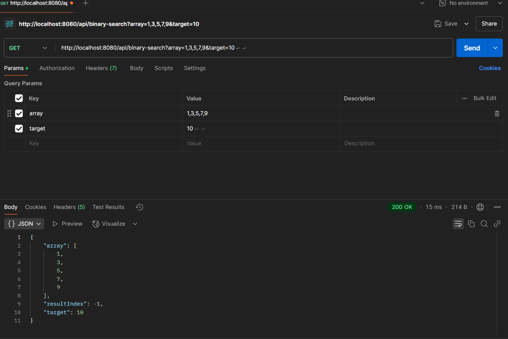

# Binary Search API - Spring Boot

## Overview
This project is a Spring Boot application that exposes a REST API for performing a binary search on a sorted list. The API allows users to send a list of numbers and a target value, and it returns the index of the target if found, otherwise -1.

## Features
- Implements the Binary Search algorithm.
- Exposes a REST API endpoint.
- Accepts JSON input containing a sorted list and a target value.
- Returns the index of the target or -1 if not found.

## Technologies Used
- Java 17
- Spring Boot
- Maven
- RESTful API

## Endpoints

### Perform Binary Search
**URL:** `POST /api/search`

**Request Body (JSON):**
```json
{
  "sortedArray": [1, 3, 5, 7, 9, 11, 13],
  "target": 7
}
```

**Response Body (JSON):**
```json
{
  "index": 3
}
```

## Running the Project

### Prerequisites
- Java 17 or later
- Maven installed

### Steps to Run
1. Clone the repository:
   ```sh
   git clone <repository-url>
   cd binary-search-api
   ```
2. Build and run the application:
   ```sh
   mvn spring-boot:run
   ```
3. The API will be available at `http://localhost:8080/api/search`

## Screenshots
### Successful API Calls
#### Element Found:


#### Element Not Found:


## AI/LLM Usage
This project was built with the assistance of AI/LLM tools for code generation, documentation, and debugging. The AI tools helped in designing the API structure.

## License
This project is open-source and available under the MIT License.

---
Happy coding! 🚀